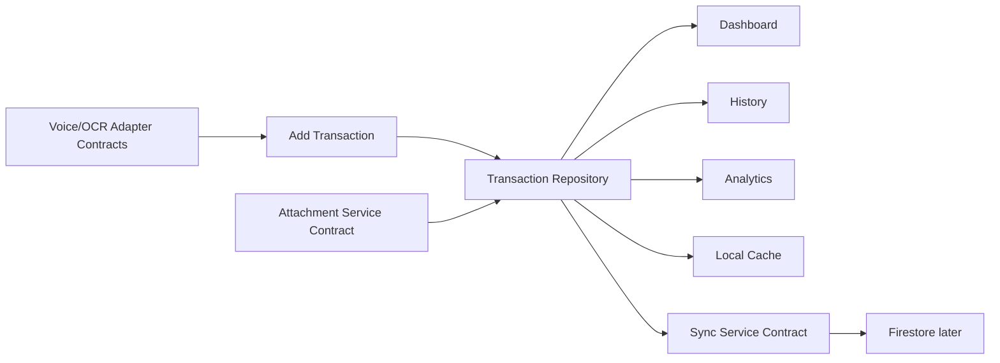

# Data Flow

The app now has a shared local transaction data flow plus frontend contracts for backend sync and capture integrations.

Current prepared flow:

`KharchaBootstrap` creates the local repositories, restores the app session through `AuthService`, injects `AppServices`, and chooses the initial route.

Related:

- [[Transactions]]
- [[Repository Plan]]
- [[State Management]]
- [[Phase 2 Real Expense Flow]]
- [[Transaction Model]]
