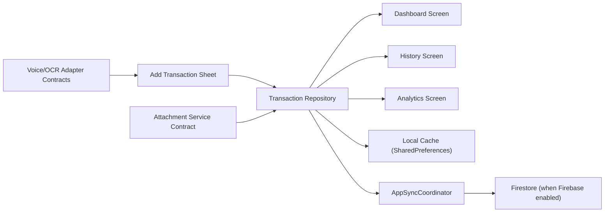

# Data Flow

The app operates on a local-first transaction data flow with automatic background synchronization via `AppSyncCoordinator`.

Current data flow:

`KharchaBootstrap` creates the local repositories, restores the app session through `AuthService`, injects `AppServices`, and chooses the initial route.

Related:

- [[Transactions]]
- [[Repository Plan]]
- [[State Management]]
- [[Firebase Architecture]]
- [[Phase 2 Real Expense Flow]]
- [[Transaction Model]]
