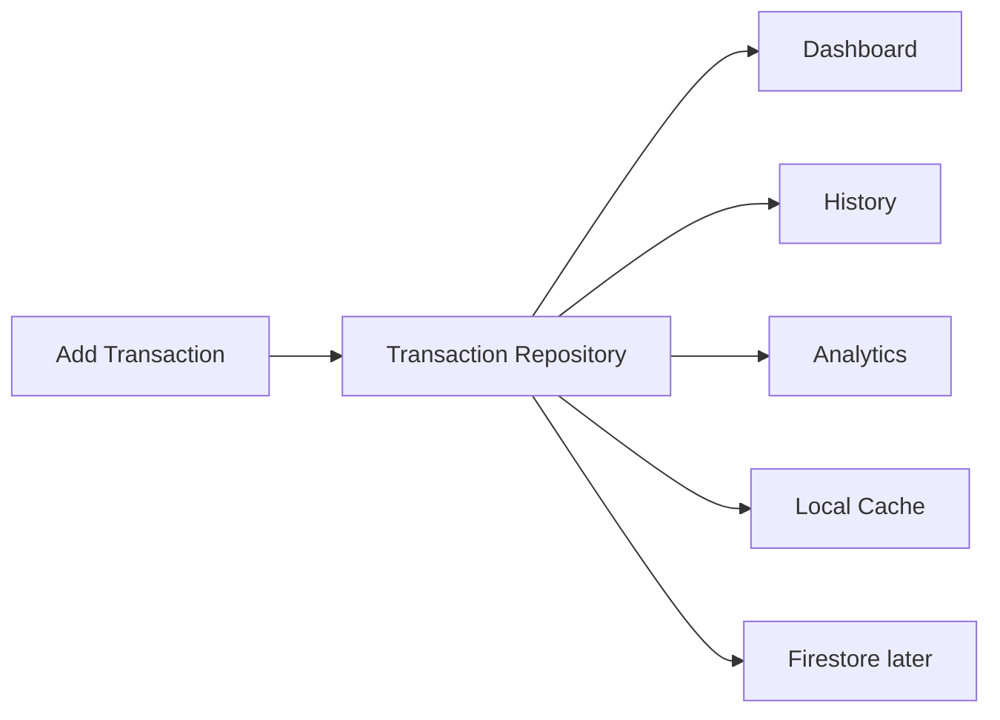

# Data Flow

The missing spine of the app is a shared transaction data flow.

Target flow:

Related:

- [[Transactions]]
- [[Repository Plan]]
- [[State Management]]
- [[Phase 2 Real Expense Flow]]
- [[Transaction Model]]
