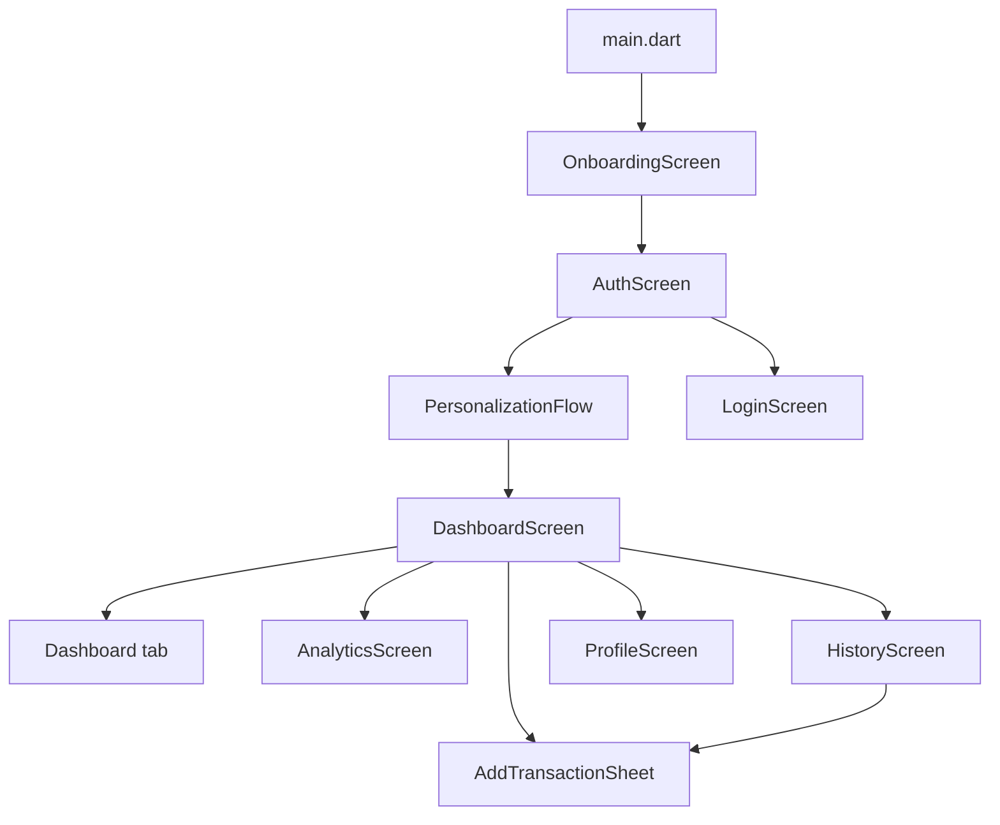

# Navigation Map

Current route flow:

```mermaid
flowchart TD
  A["main.dart"] --> B["OnboardingScreen"]
  B --> C["AuthScreen"]
  C --> D["PersonalizationFlow"]
  C --> E["LoginScreen"]
  D --> F["DashboardScreen"]
  F --> G["Dashboard tab"]
  F --> H["AnalyticsScreen"]
  F --> I["HistoryScreen"]
  F --> J["ProfileScreen"]
  F --> K["AddTransactionSheet"]
  I --> K
```

Related:

- [[Flutter Entry Point]]
- [[Dashboard]]
- [[Auth Login]]
- [[Personalization]]
