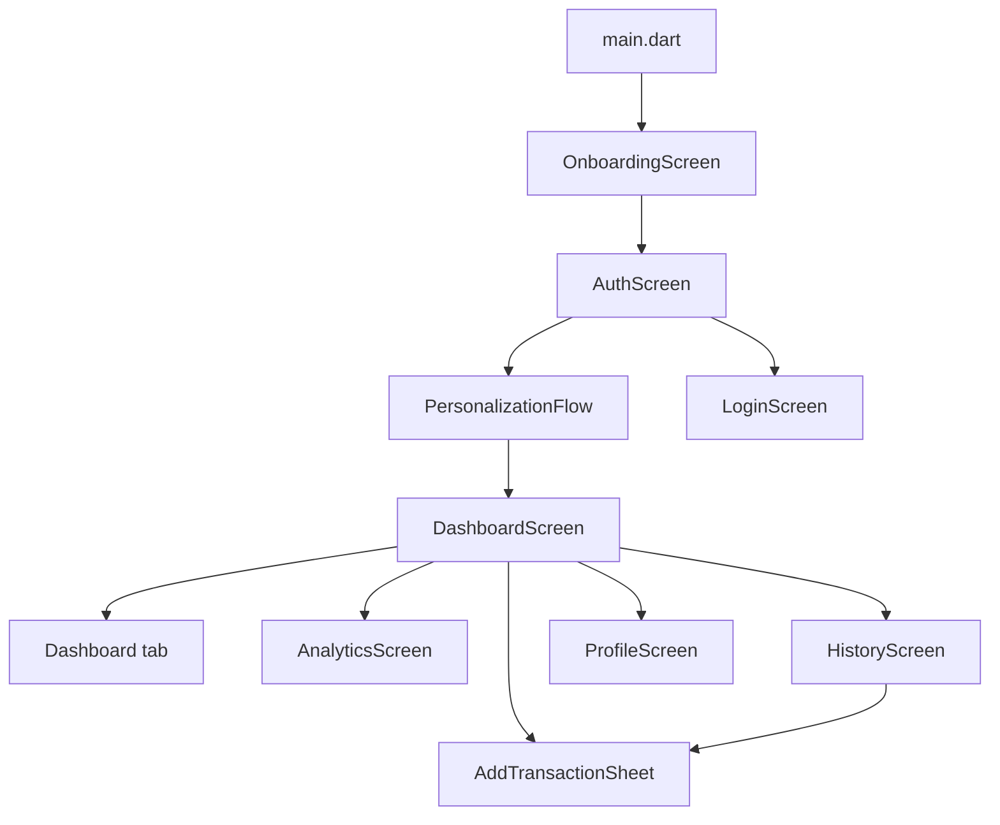

# Navigation Map

Current route flow:

Dashboard tab back behavior:

- System back from Analytics, History, or Profile selects the Dashboard Home tab.
- System back only leaves the Dashboard route when Home is already active.

Related:

- [[Flutter Entry Point]]
- [[Dashboard]]
- [[Auth Login]]
- [[Personalization]]
