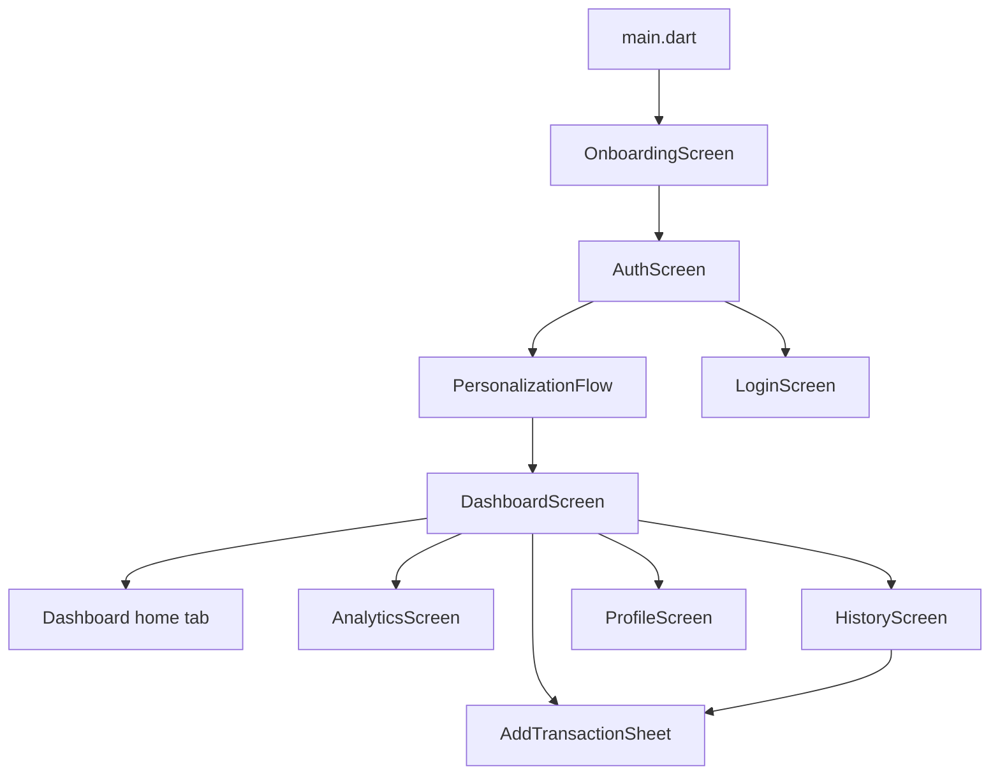
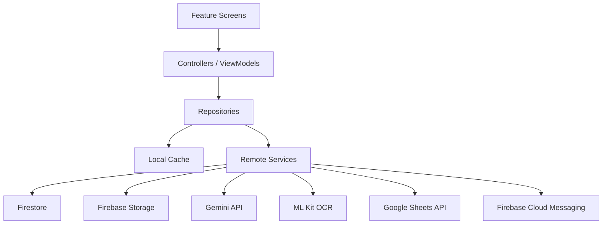

# Kharcha Architecture

Last updated: 2026-07-15

This document captures the current architecture and the recommended target architecture for Kharcha.

## Current Stack

Current Flutter dependencies from `kharcha/pubspec.yaml`:

- Flutter SDK.
- `cupertino_icons`.
- `google_fonts`.
- `intl`.
- `phosphor_flutter`.
- `fl_chart`.

Current dev dependencies:

- `flutter_test`.
- `flutter_lints`.

Important: the current app does not yet include Firebase, Gemini, ML Kit OCR, speech, camera, Google Sheets, CSV, or PDF packages.

## Current Project Structure

Main Flutter app:

- `kharcha/lib/main.dart`
- `kharcha/lib/theme/`
- `kharcha/lib/models/transaction.dart`
- `kharcha/lib/features/onboarding/`
- `kharcha/lib/features/auth/`
- `kharcha/lib/features/dashboard/`
- `kharcha/lib/features/transactions/`
- `kharcha/lib/features/analytics/`
- `kharcha/lib/features/history/`
- `kharcha/lib/features/profile/`

Theme layer:

- `kharcha/lib/theme/app_colors.dart`
- `kharcha/lib/theme/app_spacing.dart`
- `kharcha/lib/theme/app_typography.dart`
- `kharcha/lib/theme/app_theme.dart`

## Current Navigation Map



## Current Screen Responsibilities

### Onboarding

Introduces the product through three screens and transitions to auth using a radial reveal animation.

### Auth/Login

Provides Google, Apple, and Email entry points. These are UI routes only right now, not real auth providers.

### Personalization

Collects budget, spending categories, name, and currency, then routes to Dashboard.

### Dashboard

Acts as the main app shell and owns the bottom navigation state. It switches between Dashboard, Analytics, History, and Profile. It opens Add Transaction from the floating add button.

### Add Transaction

Bottom sheet with Voice, Scan, and Manual tabs. Save is simulated and currently returns `true`.

### History

Uses internal mock transactions. Supports search, filters, grouping, expansion, deletion, and edit sheet launch.

### Analytics

Uses internal mock chart data. Displays animated charts and insight-style UI.

### Profile

Contains profile header, settings sections, budget/category/currency pickers, toggles, feedback, logout, and delete-account UI.

## Current Data Model

`Transaction` currently contains:

- `id`
- `merchant`
- `category`
- `amount`
- `date`
- `note`
- `method`
- `source`
- `isIncome`

`TransactionSource` values:

- `voice`
- `scan`
- `manual`

## Current Architecture Limitation

The app is currently UI-rich but data-light. Several screens independently own mock or local state. This prevents the core loop from working end-to-end.

The most important architectural fix is to create a shared transaction source of truth before adding backend integrations.

## Recommended Target Architecture



## Recommended Folders

```text
lib/
  core/
    routing/
    constants/
    permissions/
    result/
  theme/
    app_colors.dart
    app_spacing.dart
    app_typography.dart
    app_theme.dart
  models/
    transaction.dart
    user_profile.dart
    budget.dart
    category.dart
  services/
    auth_service.dart
    firestore_service.dart
    storage_service.dart
    gemini_expense_parser.dart
    ocr_service.dart
    notification_service.dart
    export_service.dart
    sheets_sync_service.dart
  repositories/
    transaction_repository.dart
    profile_repository.dart
    budget_repository.dart
  features/
    onboarding/
    auth/
    dashboard/
    transactions/
    analytics/
    history/
    profile/
    notifications/
```

## Recommended Near-Term Implementation Order

1. Add a local `TransactionRepository`.
2. Make Add Transaction create a real `Transaction`.
3. Feed Dashboard, History, and Analytics from the repository.
4. Add notification/profile avatar routing.
5. Clean hardcoded colors.
6. Add Firebase Auth and Firestore.
7. Add Gemini voice parser.
8. Add ML Kit OCR.
9. Add export and sync services.

## Backend Target

Target cloud services:

- Firebase Auth for Google, Apple, and Email auth.
- Firestore for users, budgets, categories, transactions, and settings.
- Firebase Storage for receipts and scanned images.
- Firebase Cloud Messaging for budget alerts, weekly digests, spending insights, and reminders.
- Gemini API for voice parsing, corrections, monthly stories, and AI insights.
- ML Kit OCR for on-device text recognition from receipts/screenshots.
- Google Sheets API for optional sync.
- CSV/PDF export for user-owned data portability.
